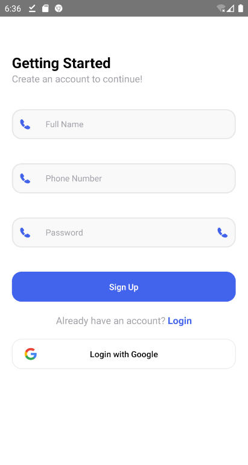
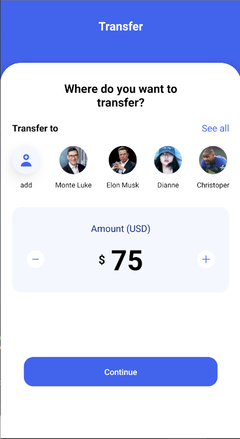
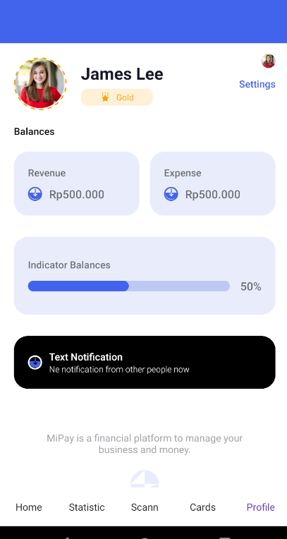

# Mipay

MIPAY is a digital payment mobile application that simplifies financial transactions for users, ensuring convenience, security and comfort. With MIPAY, users easily handle various financial tasks, including bill payments, money transfers.

This is a new [**React Native**](https://reactnative.dev) project, bootstrapped using [`@react-native-community/cli`](https://github.com/react-native-community/cli).

This application uses several tools/libraries, including:

- [React-navigation](https://reactnavigation.org/docs/getting-started/),
- [native-camera](https://www.npmjs.com/package/react-native-camera),
- [Vector icons](https://oblador.github.io/react-native-vector-icons),
- [qrcode-scanner](https://www.npmjs.com/package/react-native-qrcode-scanner)

## Screens App Test [Release](https://github.com/mardibll/MiPay/releases)

<p align="center" height:300>
     
     
    <!-- <br/>
     
     
      -->
</p>

## Getting Started

> **Note**: Make sure you have completed the [React Native - Environment Setup](https://reactnative.dev/docs/environment-setup) instructions till "Creating a new application" step, before proceeding.

### Step 1: Start the Metro Server

First, you will need to start **Metro**, the JavaScript _bundler_ that ships _with_ React Native.

```bash
# using npm
npm start

# OR using Yarn
yarn start
```

### Step 2: Start your Application

Let Metro Bundler run in its _own_ terminal. Open a _new_ terminal from the _root_ of your React Native project. Run the following command to start your _Android_ or _iOS_ app:

#### For Android

```bash
# using npm
npm run android

# OR using Yarn
yarn android
```

#### For iOS

```bash
# using npm
npm run ios

# OR using Yarn
yarn ios
```

If everything is set up _correctly_, you should see your new app running in your _Android Emulator_ or _iOS Simulator_ shortly provided you have set up your emulator/simulator correctly.

### Congratulations! :tada:

You've successfully run.
